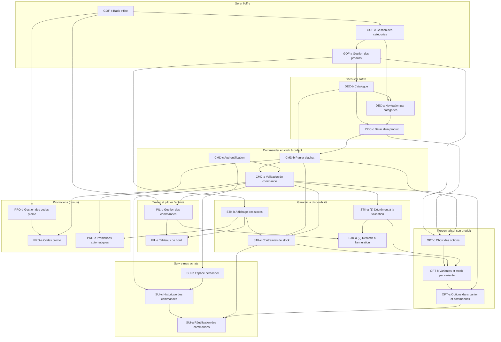

```mermaid
flowchart TD
  subgraph GOF["Gérer l'offre"]
    GOFb["GOF-b Back-office"]
    GOFc["GOF-c Gestion des catégories"]
    GOFa["GOF-a Gestion des produits"]
  end
  subgraph DEC["Découvrir l'offre"]
    DECb["DEC-b Catalogue"]
    DECa["DEC-a Navigation par catégories"]
    DECc["DEC-c Détail d'un produit"]
  end

  subgraph CMD["Commander en click & collect"]
    CMDc["CMD-c Authentification"]
    CMDb["CMD-b Panier d'achat"]
    CMDa["CMD-a Validation de commande"]
  end

  subgraph STK["Garantir la disponibilité"]
    STKb["STK-b Affichage des stocks"]
    STKc["STK-c Contraintes de stock"]
    STKa1["STK-a (1) Décrément à la validation"]
    STKa2["STK-a (2) Recrédit à l'annulation"]
  end

  subgraph PIL["Traiter et piloter l'activité"]
    PILb["PIL-b Gestion des commandes"]
    PILa["PIL-a Tableaux de bord"]
  end

  subgraph OPT["Personnaliser son produit"]
    OPTc["OPT-c Choix des options"]
    OPTb["OPT-b Variantes et stock par variante"]
    OPTa["OPT-a Options dans panier et commandes"]
  end

  subgraph SUI["Suivre mes achats"]
    SUIb["SUI-b Espace personnel"]
    SUIc["SUI-c Historique des commandes"]
    SUIa["SUI-a Réutilisation des commandes"]
  end

  subgraph PRO["Promotions (bonus)"]
    PROb["PRO-b Gestion des codes promo"]
    PROa["PRO-a Codes promo"]
    PROc["PRO-c Promotions automatiques"]
  end
  GOFb --> GOFc
  GOFc --> GOFa
  GOFa --> DECb
  GOFc --> DECa
  DECb --> DECa
  DECb --> DECc
  DECa -.-> DECc
  DECb --> CMDb
  DECc --> CMDb
  CMDb --> CMDa
  CMDc --> CMDa
  GOFa --> STKb
  STKb --> STKc
  CMDb --> STKc
  CMDa --> STKc
  CMDa --> STKa1
  STKa1 --> STKa2
  GOFb --> PILb
  CMDa --> PILb
  PILb --> STKa2
  PILb --> PILa
  STKb --> PILa
  GOFa --> OPTc
  DECc --> OPTc
  CMDb --> OPTc
  OPTc --> OPTb
  STKc --> OPTb
  STKa1 --> OPTb
  OPTb --> OPTa
  CMDa --> OPTa
  CMDc --> SUIb
  CMDa --> SUIc
  SUIb --> SUIc
  SUIc --> SUIa
  STKc --> SUIa
  OPTa --> SUIa
  GOFb --> PROb
  PROb --> PROa
  CMDa --> PROa
  STKb --> PROc
  CMDb --> PROc
```
